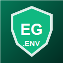

# Env Guardian



Validate, secure, and scan environment files without leaving VS Code.

Env Guardian brings the `envguard` CLI into the Command Palette so you can catch missing variables, leaked secrets, invalid env syntax, unsafe logs, and CI-breaking configuration problems from the editor.

[Repository](https://github.com/vulkanCommand/env-guardian) | [Issues](https://github.com/vulkanCommand/env-guardian/issues) | [CLI README](https://github.com/vulkanCommand/env-guardian#readme)

## Why Use It

Env files are small until they break production. Env Guardian helps you check them early:

| Check | What it catches |
| --- | --- |
| Validation | missing keys, duplicate keys, unused keys, typed value errors |
| Security | secret-looking values in env files, repository files, and git history |
| Log scan | source code and logs that expose env values |
| CI check | fail-fast validation designed for automation |
| Multi-env | `.env.dev`, `.env.prod`, and `.env.test` consistency |

## Install the CLI

This extension uses the Env Guardian CLI installed on your machine.

```bash
curl -fsSL https://raw.githubusercontent.com/vulkanCommand/env-guardian/main/scripts/install.sh | sh
```

Confirm VS Code can find it:

```bash
envguard version
```

## Run From VS Code

Open the Command Palette:

```text
Ctrl+Shift+P
```

Then run:

| Command | Purpose |
| --- | --- |
| `Env Guardian: Validate` | validate `.env` against `.env.example` |
| `Env Guardian: Validate All Environments` | validate dev, prod, and test env files |
| `Env Guardian: Run CI Check` | run fail-fast CI validation |
| `Env Guardian: Run Security Scan` | scan env files, repository files, and git history |
| `Env Guardian: Run Log Exposure Scan` | detect accidental env value logging |
| `Env Guardian: Show Version` | show the installed CLI version |

Results open in the `Env Guardian` output panel.

## Settings

| Setting | Default | Description |
| --- | --- | --- |
| `envGuardian.executablePath` | `envguard` | path to the Env Guardian CLI |
| `envGuardian.envFile` | `.env` | target env file |
| `envGuardian.exampleFile` | `.env.example` | example env file |
| `envGuardian.rootDirectory` | `.` | root directory for scan commands |
| `envGuardian.useJson` | `false` | pass `--json` to supported commands |

## If VS Code Cannot Find Env Guardian

The extension will show action buttons to copy the install command, open settings, or open GitHub Issues.

If Env Guardian is already installed, set the full binary path:

```json
{
  "envGuardian.executablePath": "C:/Users/gdkal/.local/bin/envguard"
}
```

## Marketplace Identifier

```text
vulkanCommand.envguard-cli
```

## Support

- Issues: https://github.com/vulkanCommand/env-guardian/issues
- Email: gdkalyan2109@gmail.com
